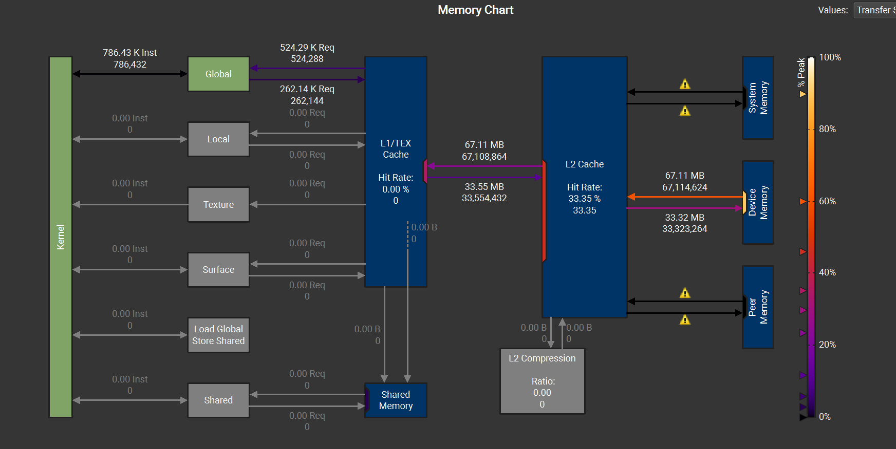
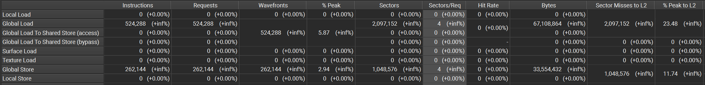

### Profile Vector add program

The code we profile is :

Total number of elements: 32 * 1024 * 1024

Block size : 64. 64 threads per block.

Grid : N/256 = Means each block will handle 256 elements. 

But this kernel, one thread handle one element.

**内存地址连续性**：如果多个线程访问的是连续的内存地址，GPU 会尽可能将这些访问合并成一个内存访问请求，从而减少延迟。

让我们通过vector add来理解访存合并和ncu的metrics

Sectors: 当我们访问一片内存的时候，GPU会按照一个Sector访问数据。如果数据是连续的，就可以被合并成一个Sector。

也就是如果32个线程load 32个float，不是发送32次数据，对于GPU，每一次都会发32

个字节。如果数据是连续的，就可以合并访存。

在这个例子中，我们访问N个数据，且都是连续的。

Grid : 32 * 1024 * 1024 /256

Block : 64 threads

total threads = 32 * 1024 * 1024 /256 * 64 = 8 * 1024 * 1024

total elements = total threads * 3 = 3 * 8 * 1024 * 1024

因为GPU是SIMT，一个warp内的所有thread共用一条指令。

total instruction = total elements/32  = total elements/32 = 786432 = 786.43K Inst

从Global到L1 的数据（Load）: 2 * 8 * 1024 * 1024/32 = 524288 requests

从L1到Global的数据（Store）：8 * 1024 * 1024/32 = 262144 requests

一次请求（一条指令），对应一个warp中的32个threads。

每次请求一个float（4 bytes），一个warp有32个threads，总共就是128 bytes。

一个sector有32 bytes。连续访存的情况下，128bytes对应4个sectors。

所以每一个Inst(Req)在合并访存最佳情况下对应4个Sectors。(Sectors/Req=4)

Global Load总共的Sectors : Total Load Req * Sectors/Req = 524288 * 4 = 2097152 Sectors

Global Store 总共的Sectors： Total Store Req * Sectors/Req = 262144 * 4 = 1048576 Sectors

所以总共需要的instructions : total_elem* 3 = 3 * 8 * 1024 * 1024 / 32

N = 32*1024 * 2024 = 33554432

load : 2 * N = 

我们需要2 * N次load和N次store

